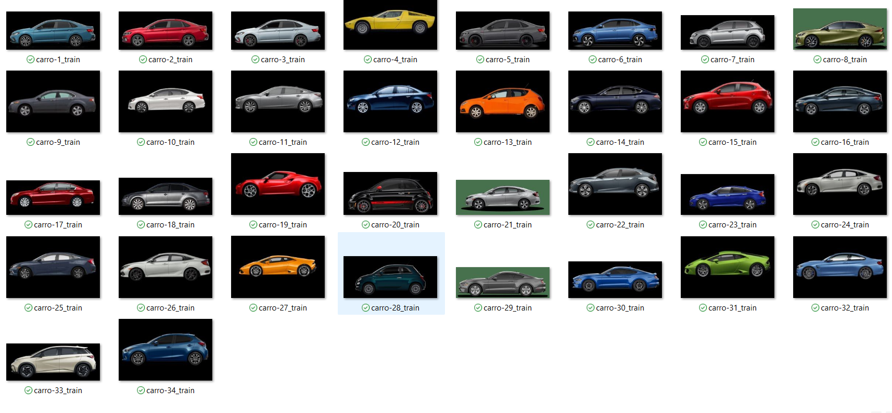
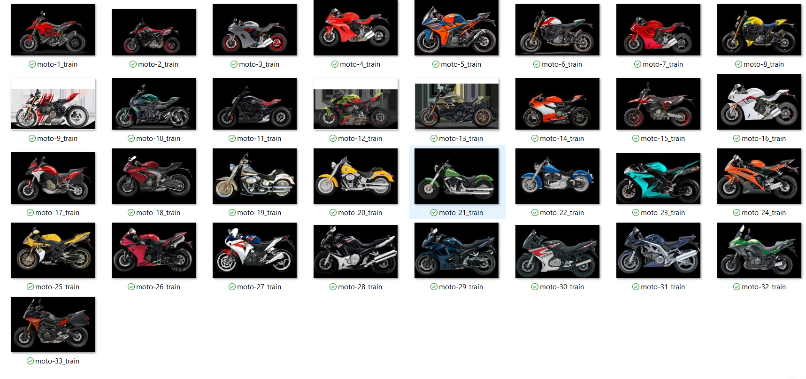
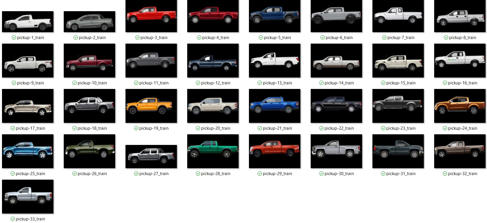
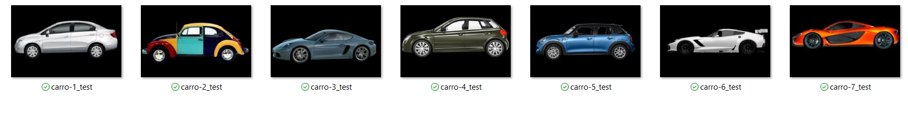
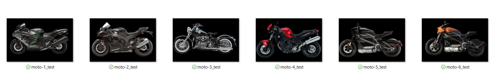
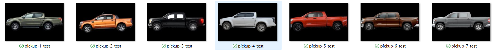

# Clasificador de Vehiculos Privados 

Este repositorio contiene el codigo y la documentacion de un modelo clasificador de imagenes de vehiculos privados, el objetivo de este trabajo es proponer una solucion que ayude a automatizar y mejorar el rendimiento en las casetas de cobro en México.

# Autor

* Miguel Angel Cabrera Victoria - A01782982

# Data Set

100 imagenes en el conjunto de entrenamiento

20 imagenes en el conjunto de prueba

### - Conjunto de entrenamiento 

### - Conjunto de prueba

